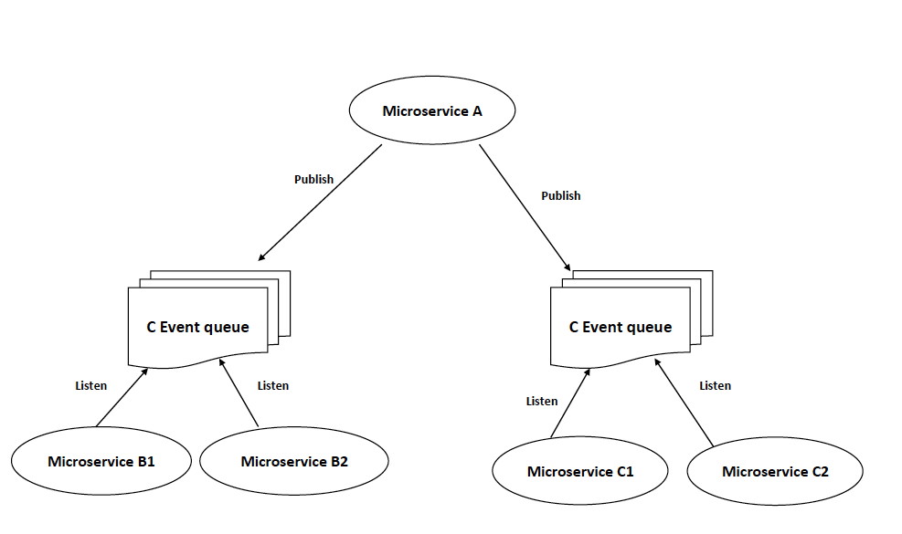

YohGo Evently
===

YohGo Evently is a machinery based package that manages events asynchronously in an event-based architecture



---------------------------------------

  * [Requirements](#requirements)
  * [Features](#features)
  * [Installation](#installation)
  * [Usage](#usage)
    * [Event Publishing](#publish-an-event)
    * [Event Listening](#listen-to-an-event)

---------------------------------------

## Requirements
   * Go (1.5+)
   * Machinery (1+)

---------------------------------------

## Features

  * Lightweight and fast
  * Native Go implementation
  * Supports `redis` and `AMQP` message brokers

---------------------------------------

## Installation

Simply install the package to your [$GOPATH](https://github.com/golang/go/wiki/GOPATH "GOPATH") with the [go tool](https://golang.org/cmd/go/ "go command") from shell:

```bash
$ go get github.com/RichardKnop/machinery/v1
$ go get github.com/yohgo/evently
```

Make sure [Git is installed](https://git-scm.com/downloads) on your machine and in your system's `PATH`.

---------------------------------------

## Usage

YohGo Evently is a package that manages events asynchronously in an event-based architecture. Evently is based on [`Machinery`](https://github.com/RichardKnop/machinery) which is an asynchronous task queue/job queue based on distributed message passing.

### Event Publishing
Example of using the `evently` package for event publishing:
```go

import (
    "github.com/yohgo/evently"
)

// A string map containing the event publisher's settings
settings := map[string]string{
    "broker"           : "A url to a redis or AMQP broker",
    "downstream_queue" : "The default downstream event queue",
    "upstream_queues"  : "A colon-separated list of upstream event queues",
    "result_backend"   : "A url to the backend result storage",
            "amqp_exchange" : "An AMQP exchange", // (only when broker = AMQP)
            "amqp_exchange" : "An AMQP exchange type", // (only when broker = AMQP)
            "amqp_exchange" : "An AMQP binding key", // (only when broker = AMQP)
}

// Creating a new event publisher
publisher := evently.NewEventPublisher(settings)

// Attempting to publish a user.updated event
if !publisher.EventPublisher.Publish("user.updated", user).IsOK() {
    return errors.New("Unable to publish the user.updated event")
}
```

For more details regarding event publisher configuration check [`Machinery Documentation`](https://github.com/RichardKnop/machinery#configuration)

### Event Listening
Example of using the `evently` package for event listening:
```go

import (
    "github.com/yohgo/evently"
)

// An event handler method (takes a json string)
func eventHandler(JSONData string) error {
    /* Event handling logic */
}

settings := map[string]string{
    "broker"           : "A url to a redis or AMQP broker",
    "downstream_queue" : "The default downstream event queue",
    "upstream_queues"  : "A colon-separated list of upstream event queues",
    "result_backend"   : "A url to the backend result storage",
            "amqp_exchange" : "An AMQP exchange", // (only when broker = AMQP)
            "amqp_exchange" : "An AMQP exchange type", // (only when broker = AMQP)
            "amqp_exchange" : "An AMQP binding key", // (only when broker = AMQP)
}

// A map of event/handler pairs
handlers := map[string]interface{}{
    "user.updated": eventHandler
}

// Creating a new event listener
listener := evently.NewEventListener("user.listener", settings, handlers)

// Attempting to start the user.updated event listener
if !listener.EventPublisher.Eavesdrop().IsOK() {
    return errors.New("Unable to start the event listener")
}
```

For more details regarding event listener configuration check [`Machinery Documentation`](https://github.com/RichardKnop/machinery#configuration)

